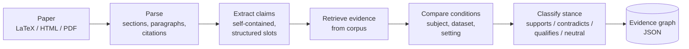

<div align="center">

# SEG: Scientific Evidence Graph

**Find not just which papers are similar, but which papers support, contradict, or qualify a specific scientific claim.**


[Overview](#overview) · [How it works](#how-it-works) · [Quickstart](#quickstart) · [Data model](#data-model) · [Research questions](#research-questions) · [Roadmap](#roadmap) · [Contributing](#contributing)

</div>

---

## Overview

Academic search tools work at the **paper level**: keywords, titles, abstracts, citations, embeddings. But researchers ask **claim-level** questions:

- Which papers support *this specific result*?
- Does any paper contradict it, and under what conditions?
- Has this method been tried on a different dataset?

SEG breaks papers into claims, retrieves candidate evidence passages from other papers, and classifies how each passage relates to the claim. The output is a graph in which **every edge points to an exact quoted span** in a source paper.

> [!NOTE]
> SEG is an early-stage research project. The pipeline below is the design target; see [Status](#status) for what is implemented today.

### Example

```text
Claim (Paper A, §Results):
  "Embedding-based routing improves agent selection accuracy over keyword
   routing on a 5-agent benchmark."

  ├── SUPPORTS     Paper B, p.7 ¶2   "...embedding routing reached 91% vs 78%..."
  ├── CONTRADICTS  Paper C, p.5 ¶4   "...no gain over keyword routing with 20+ agents..."
  └── QUALIFIES    Paper D, p.9 ¶1   "...gains hold only with in-domain fine-tuning..."
```

Note how Paper C is not simply "contradicting": its conditions (20+ agents) differ. SEG compares conditions before assigning stance, because many apparent contradictions disappear once datasets and settings are aligned.

## How it works



| Stage | Input | Output |
|---|---|---|
| **Parse** | LaTeX, HTML, or PDF | `Paper` with sections, paragraphs, citation mentions, offsets |
| **Extract** | check-worthy paragraphs | `Claim` with decontextualized text, subject, outcome, dataset, conditions |
| **Retrieve** | claim | ranked evidence passages from a fixed corpus |
| **Compare** | claim + passage | `ConditionMatch` (same subject? dataset? setting?) |
| **Classify** | claim + passage + match | `EvidenceEdge` with stance, confidence, rationale |
| **Build** | edges | graph (JSON, NetworkX) |

### Design principles

1. **Evidence before generation.** An edge exists only if an exact supporting span exists.
2. **Provenance everywhere.** Every claim and edge traces to paper, page, section, paragraph, and character offsets.
3. **Claim ≠ sentence.** Claims are rewritten to be self-contained, otherwise "our method improves accuracy" cannot be compared with anything.
4. **Claim-level and paper-level relations are different.** Stance (supports/contradicts) is claim-to-passage. Relations like *cites* or *same dataset* come from metadata, not an LLM.
5. **Modular and benchmarked.** Every stage is replaceable and evaluated independently.
6. **Reproducible.** Pinned model and prompt versions, cached LLM calls, versioned schemas, JSON artifacts per stage.

## Status

| Component | State |
|---|---|
| Data schema | ✅ defined ([`schema.py`](src/evidence_graph/models/schema.py)) |
| Parsing design | ✅ documented ([`docs/PARSING.md`](docs/PARSING.md)) |
| PDF / TEI parsing | 🚧 in progress |
| Claim extraction | 📋 planned |
| Retrieval + baselines | 📋 planned |
| Stance classification | 📋 planned |
| Graph export | 📋 planned |
| Review UI | 📋 planned |

See [`ROADMAP.md`](ROADMAP.md) for milestones and exit criteria.

## Quickstart

**Requirements:** Python 3.11+, [uv](https://docs.astral.sh/uv/), Docker (only for GROBID PDF parsing).

```bash
git clone https://github.com/glemiu6/SEG.git
cd SEG
uv sync
```

Start GROBID for PDF parsing (optional if you use arXiv LaTeX/HTML sources):

```bash
docker run --rm -p 8070:8070 lfoppiano/grobid:0.8.1
```

Configure your LLM provider:

```bash
cp .env.example .env   # then set your API key and model names
```

Run the pipeline on a paper:

```bash
uv run python -m evidence_graph.main data/papers/example.pdf
```

Outputs:

```text
data/parsed/example.json          # structured Paper
data/parsed/example.claims.json   # extracted Claims
data/results/example.graph.json   # evidence graph
```

Run tests:

```bash
uv run pytest
```

## Data model

All stages exchange validated [Pydantic](https://docs.pydantic.dev) models.

```text
Paper ── Section ── Paragraph ── CitationMention
  │
  └── Claim ── EvidenceEdge ──▶ Span (exact evidence in another paper)
                    │
                    ├── stance: supports | contradicts | qualifies | neutral
                    ├── confidence, rationale
                    └── condition_match
PaperRelation: cites | same_dataset | same_method   (from metadata, not LLM)
```

A claim looks like this:

```json
{
  "id": "arxiv:2401.01234:c7",
  "original_text": "Our router improves accuracy by 6 points.",
  "canonical_text": "Semantic-similarity routing improves agent selection accuracy by 6 points over keyword routing on RouterBench.",
  "type": "result",
  "subject": "semantic-similarity routing",
  "comparator": "keyword routing",
  "outcome": "agent selection accuracy",
  "direction": "increase",
  "value": "+6 points",
  "dataset": "RouterBench",
  "conditions": ["5 agents", "English"],
  "source": { "paper_id": "arxiv:2401.01234", "section_id": "…:s4", "page_start": 7 }
}
```

An edge looks like this:

```json
{
  "claim_id": "arxiv:2401.01234:c7",
  "stance": "qualifies",
  "confidence": 0.78,
  "rationale": "Gains reported only with in-domain fine-tuning; the original claim states no such condition.",
  "evidence": { "paper_id": "arxiv:2402.05555", "page_start": 9, "text": "…" },
  "condition_match": { "same_subject": true, "same_dataset": false }
}
```

## Research questions

SEG doubles as a testbed for scientific information retrieval:

- **RQ1.** Does claim-level retrieval find contradicting and qualifying evidence better than abstract-level retrieval?
- **RQ2.** Does structure-preserving parsing improve claim extraction?
- **RQ3.** Can LLMs reliably classify stance between scientific claims, once conditions are compared?

Planned evaluation: SciFact / SciFact-Open for sanity checks, plus a hand-labeled gold set with inter-annotator agreement. Baselines include BM25, SPECTER2, cross-encoder rerankers, NLI models, and LLMs. Ablations cover retrieval granularity, parsing quality, claim decontextualization, and embedding models.

### Results

*Pending. This table will be filled in as milestone M3 completes.*

| Retrieval level | Recall@10 | Contradiction-recall@10 |
|---|---|---|
| Abstract (BM25) | – | – |
| Abstract (SPECTER2) | – | – |
| Paragraph (dense) | – | – |
| Claim (dense) | – | – |

## Repository layout

```text
src/evidence_graph/
├── models/       # Pydantic schema
├── ingestion/    # PDF/TEI/LaTeX → sections, paragraphs
├── extraction/   # claim extraction
├── llm/          # client, prompts, cache
├── retrieval/    # corpus index, embeddings, reranking
├── relations/    # stance classification
├── graph/        # builder, exporters
├── storage/      # JSON artifact store
└── pipeline/     # stage orchestration
data/             # papers, parsed, results (git-ignored)
experiments/      # benchmarks, notebooks, results
docs/             # design docs
tests/
```

## Roadmap

1. Schema, LLM client with caching *(M0)*
2. Parsing: arXiv LaTeX/HTML, GROBID *(M1)*
3. Corpus and claim extraction *(M2)*
4. Gold set and baselines *(M3)*
5. End-to-end vertical slice *(M4)*
6. Ablations and error analysis *(M5)*
7. Review UI and graph visualization *(M6)*
8. Write-up and release *(M7)*

Deferred until the core is validated: `EXTENDS` relations, Obsidian export, FastAPI/React frontend, FAISS at scale.

Details in [`ROADMAP.md`](ROADMAP.md).

## Related work

SEG builds on, and aims to differ from:

- [SciFact](https://github.com/allenai/scifact): claim verification against abstracts
- [scite](https://scite.ai): supporting/contrasting citation statements
- Citation intent classification (SciCite, ACL-ARC)
- [S2ORC](https://github.com/allenai/s2orc) / [unarXive](https://github.com/IllDepence/unarXive): structured full-text corpora
- [ORKG](https://orkg.org): structured scholarly knowledge

The difference: claim-to-passage evidence retrieved beyond direct citations, with condition-aware stance and exact-span provenance.

## Contributing

Contributions are welcome, especially:

- annotated claim/evidence pairs
- parser comparisons on papers from your field
- new baselines for retrieval or stance classification

Open an issue before large changes. Run `uv run pytest` and keep schema changes versioned.

## Citation

```bibtex
@software{seg2026,
  title  = {SEG: Scientific Evidence Graph},
  author = {Your Name},
  year   = {2026},
  url    = {https://github.com/glemiu6/SEG}
}
```

## License

MIT. See [`LICENSE`](LICENSE).